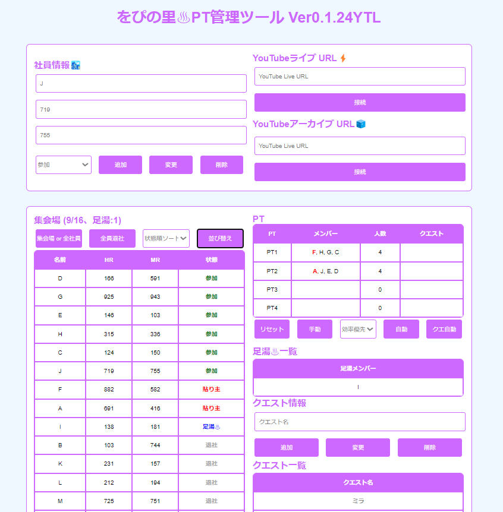
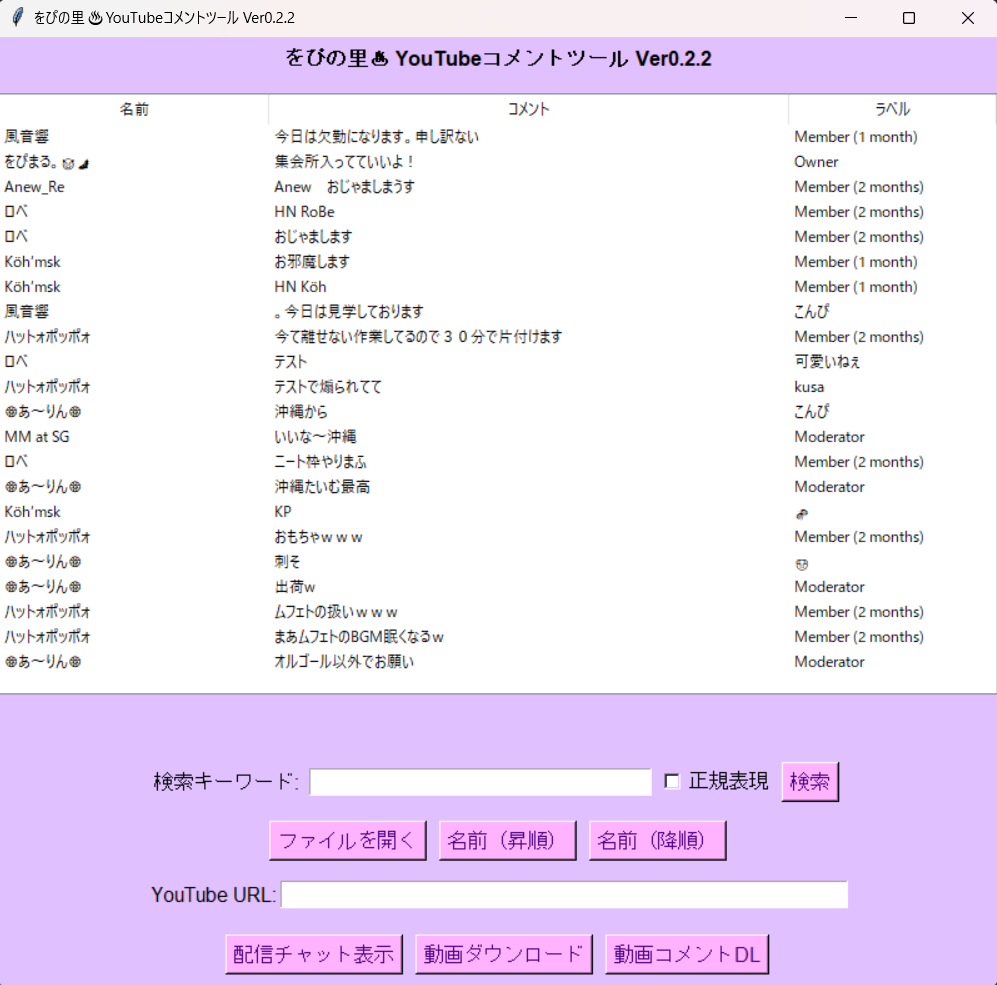
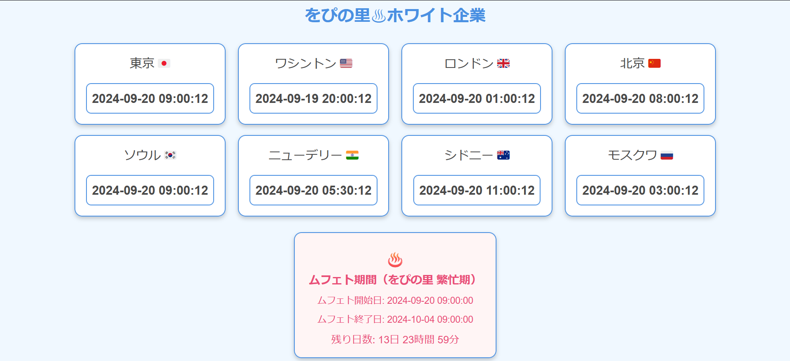

# をぴの里♨ツール開発
をぴの里でつくっている管理ツール♨🥳

## ✅システム構成

凡例 : ✅実装済み、 ❌未実装

- ✅`YTコメントツール` ... YouTubeコメント管理ツール
  - ✅Youtubeからコメントを取得(*.json)
  - ✅コメントを検索、並び替え、正規表現

- ✅`PT管理ツール` ... モンハンの集会所管理ツール
  - ✅クエストとメンバーの割り振り手動 or 自動
  - ✅管理情報はWEBブラウザのローカルストレージ
  - ❌YouTubeコメントから参加、待機を自動変更

# 各ツール🔗

## PT管理ツール
🔗[PT管理ツール(*.html)](wopi_mh_pt_tool/wopi_mh_pt_yt_live.html)
🔗[説明書](wopi_mh_pt_tool/README.md)
🔗[ソースコード](wopi_mh_pt_tool/wopi_mh_pt_yt_live.html)

## YTコメントツール

🔗[YTコメントツール(*.exe)](wopi_cmt_tool/bin/)
🔗[説明書](wopi_cmt_tool/README.md)
🔗[ソースコード](wopi_cmt_tool/yt_cmt_pytchat_gui.py)

## ムフェト時計

🔗[ムフェト時計](wopi_mufeto_clock/wopi_mufeto_clock.html)
🔗[説明書](wopi_mufeto_clock/README.md)

